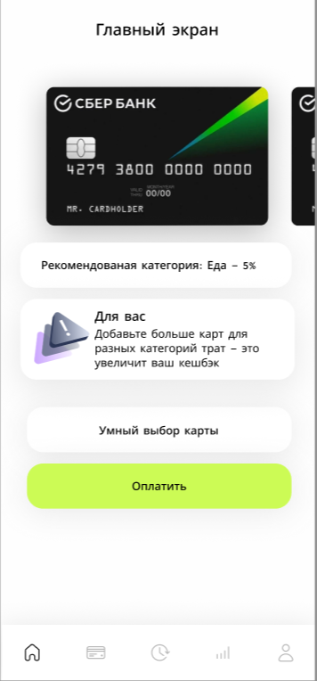
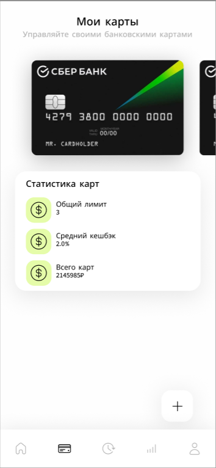
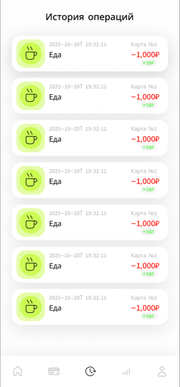
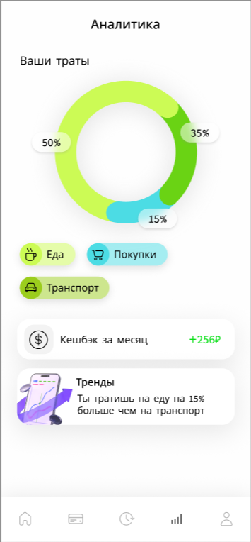
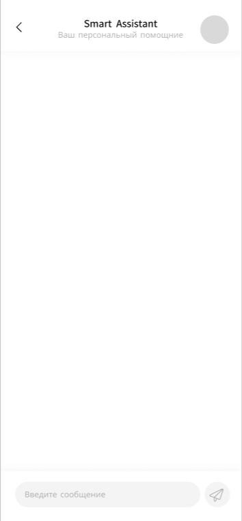
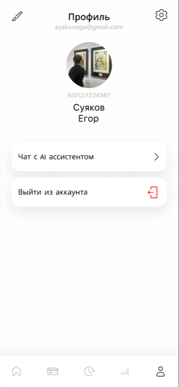

# 💳 SmartWallet - Умный финансовый кошелек

<div align="center">


**Современное Android приложение для умного управления банковскими картами с AI-ассистентом и автоматическими рекомендациями по кэшбэку**

[Особенности](#-особенности) • [Установка](#-установка) • [Технологии](#-технологии) • [Архитектура](#-архитектура) • [API](#-api-endpoints)

</div>

---

## 📱 О приложении

**SmartWallet** — это интеллектуальное мобильное приложение для управления финансами, которое помогает пользователям максимизировать кэшбэк от своих банковских карт и принимать осознанные финансовые решения с помощью встроенного AI-ассистента.

### 🎯 Основная цель

Помочь пользователям:
- 💰 Получать максимальный кэшбэк от каждой покупки
- 📊 Отслеживать и анализировать свои расходы
- 🤖 Получать персональные финансовые рекомендации от AI
- 💳 Управлять всеми картами в одном месте

---

## ✨ Особенности

### 🔐 Безопасная аутентификация
- Регистрация и вход с JWT токенами
- Безопасное хранение учетных данных
- Автоматическое управление сессиями

### 💳 Управление картами
- Добавление и управление банковскими картами
- Просмотр правил кэшбэка для каждой карты
- Визуальное отображение информации о картах
- Быстрый доступ к активной карте

### 🎯 Умные рекомендации
- Автоматический выбор карты с максимальным кэшбэком для покупки
- Персонализированные рекомендации на основе категории товара
- Real-time расчет потенциального кэшбэка

### 📊 Аналитика и статистика
- Интерактивные графики расходов (MPAndroidChart)
- Анализ трат по категориям
- Визуализация истории кэшбэка
- Детальная статистика использования карт

### 💬 AI-ассистент
- Интеллектуальный чат-бот для финансовых вопросов
- Советы по бюджетированию и инвестициям
- Помощь в принятии финансовых решений
- Образовательный контент по финансовой грамотности

### 📝 История транзакций
- Полная история всех операций
- Фильтрация по дате и категориям
- Детальная информация о каждой транзакции
- Отслеживание полученного кэшбэка

### 👤 Профиль пользователя
- Управление личными данными
- Статистика использования приложения
- Настройки безопасности
- Выход из аккаунта

---

## 🛠 Технологии

### Основной стек
- **Язык**: Java 11
- **Min SDK**: Android 8.0 (API 26)
- **Target SDK**: Android 14+ (API 36)
- **Gradle**: 8.13.0 (Kotlin DSL)

### Основные библиотеки

#### Сеть и API
```gradle
Retrofit 2.11.0          // REST API клиент
OkHttp 4.12.0           // HTTP клиент и логирование
Gson                     // JSON сериализация
```

#### UI и дизайн
```gradle
Material Design 1.13.0   // Material Components
ViewPager2 1.1.0        // Swipeable views
MPAndroidChart 3.1.0    // Графики и диаграммы
SwipeRefreshLayout      // Pull-to-refresh
```

#### Android Components
```gradle
AndroidX AppCompat
ConstraintLayout
RecyclerView
Fragment
LiveData & ViewModel
```

### Архитектурные паттерны
- **MVVM** (Model-View-ViewModel) для UI логики
- **Repository Pattern** для работы с данными
- **Singleton Pattern** для API клиента и менеджеров
- **Observer Pattern** через LiveData

---

## 🏗 Архитектура

### Структура проекта

```
app/src/main/java/com/example/smartwallet/
│
├── 📱 ui/                          # Пользовательский интерфейс
│   ├── MainActivity.java           # Точка входа
│   ├── AuthActivity.java           # Аутентификация
│   ├── DashboardActivity.java      # Главный экран с навигацией
│   ├── AssistantActivity.java      # AI-ассистент чат
│   │
│   ├── HomeFragment.java           # Главная с рекомендациями
│   ├── CardsFragment.java          # Управление картами
│   ├── HistoryFragment.java        # История транзакций
│   ├── AnalyticsFragment.java      # Графики и аналитика
│   ├── ProfileFragment.java        # Профиль пользователя
│   ├── LoginFragment.java          # Форма входа
│   ├── RegisterFragment.java       # Форма регистрации
│   │
│   └── adapter/                    # RecyclerView адаптеры
│       ├── CardsAdapter.java
│       ├── TransactionsAdapter.java
│       └── ChatAdapter.java
│
├── 🌐 network/                     # Сетевой слой
│   ├── ApiClient.java              # Retrofit клиент
│   ├── AuthApi.java                # Эндпоинты авторизации
│   ├── CardsApi.java               # Эндпоинты карт
│   ├── TransactionsApi.java        # Эндпоинты транзакций
│   ├── CashbackApi.java            # Эндпоинты кэшбэка
│   ├── AssistantApi.java           # Эндпоинты AI-ассистента
│   │
│   └── dto/                        # Data Transfer Objects
│       ├── LoginRequest.java
│       ├── TokenResponse.java
│       ├── Card.java
│       ├── Transaction.java
│       ├── ChatRequest.java
│       └── ...
│
├── 🎨 model/                       # Модели данных
│   └── ChatMessage.java
│
├── 🧠 viewmodel/                   # ViewModels (MVVM)
│   ├── ChatViewModel.java
│   ├── AnalyticsViewModel.java
│   └── HistoryViewModel.java
│
└── 🛠 utils/                       # Утилиты
    ├── TokenManager.java           # Управление JWT токенами
    ├── ErrorHandler.java           # Обработка ошибок
    ├── Logger.java                 # Логирование
    ├── DateUtils.java              # Работа с датами
    ├── CurrencyUtils.java          # Форматирование валюты
    ├── ValidationUtils.java        # Валидация форм
    └── ...
```

### Навигация приложения

```
MainActivity (Splash & Permissions)
    ↓
AuthActivity (ViewPager2)
    ├── LoginFragment
    └── RegisterFragment
    ↓
DashboardActivity (Bottom Navigation)
    ├── HomeFragment           [Главная]
    ├── CardsFragment          [Мои карты]
    ├── HistoryFragment        [История]
    ├── AnalyticsFragment      [Аналитика]
    └── ProfileFragment        [Профиль]
    
AssistantActivity              [AI Чат]
    └── Открывается из HomeFragment
```

---

## 🔌 API Endpoints

### Base URL
```
http://192.168.0.110:8000/
```

### Аутентификация
```http
POST   /auth/register              # Регистрация
POST   /auth/login                 # Вход
GET    /auth/profile               # Получить профиль
```

### Карты
```http
GET    /cards/                     # Получить все карты
GET    /cards/{card_id}            # Получить карту по ID
POST   /cards/                     # Создать новую карту
```

### Транзакции
```http
GET    /transactions               # История транзакций
POST   /transactions               # Создать транзакцию
```

### Кэшбэк
```http
GET    /cashback/best-card         # Получить лучшую карту для категории
GET    /cashback/rules/{card_id}  # Правила кэшбэка для карты
```

### AI-ассистент
```http
POST   /assistant/chat             # Отправить сообщение
GET    /assistant/recommendations  # Получить рекомендации
```

### Аналитика
```http
GET    /analytics/spending         # Статистика трат
GET    /analytics/cashback         # Статистика кэшбэка
```

---

## 📥 Установка

### Требования
- Android Studio Hedgehog | 2023.1.1 или новее
- JDK 11 или выше
- Android SDK 36
- Gradle 8.13.0+

### Шаги установки

1. **Клонируйте репозиторий**
```bash
git clone https://github.com/yourusername/SmartWallet.git
cd SmartWallet
```

2. **Откройте проект в Android Studio**
```bash
# Или используйте: File → Open → выберите папку SmartWallet
studio .
```

3. **Настройте Backend URL**

Откройте `app/src/main/java/com/example/smartwallet/network/ApiClient.java`:
```java
private static final String BASE_URL = "http://YOUR_BACKEND_URL:8000/";
```

4. **Настройте Network Security (для HTTP)**

Файл `app/src/main/res/xml/network_security_config.xml` уже настроен для работы с локальным сервером.

5. **Синхронизируйте Gradle**
```bash
./gradlew clean build
```

6. **Запустите приложение**
- Подключите Android устройство или запустите эмулятор
- Нажмите Run (▶️) или используйте `Shift + F10`

---

## 🚀 Быстрый старт

### Для разработчиков

1. **Добавьте новый API эндпоинт**
```java
// В соответствующем *Api.java интерфейсе
@GET("endpoint")
Call<ResponseType> methodName(@Header("Authorization") String token);
```

2. **Создайте новый фрагмент**
```java
public class NewFragment extends Fragment {
    @Override
    public View onCreateView(LayoutInflater inflater, ViewGroup container, 
                             Bundle savedInstanceState) {
        return inflater.inflate(R.layout.fragment_new, container, false);
    }
}
```

3. **Добавьте в навигацию**
```java
// В DashboardActivity.java
bottomNav.setOnItemSelectedListener(item -> {
    if (item.getItemId() == R.id.tab_new) {
        switchFragment(new NewFragment());
        return true;
    }
    // ...
});
```

### Для пользователей

1. Запустите приложение
2. Зарегистрируйтесь или войдите
3. Добавьте свои банковские карты
4. Начните совершать транзакции
5. Получайте умные рекомендации!

---

## 🎨 Дизайн

### Цветовая схема
- **Primary**: `#4CAF50` (Green)
- **Primary Dark**: `#388E3C`
- **Accent**: `#81C784` (Light Green)
- **Background**: `#F1F8E9` (Light Green 50)
- **Card Background**: `#FFFFFF`
- **Text Primary**: `#212121`
- **Text Secondary**: `#757575`

### Шрифты
- **Logo**: Narnoor Bold
- **UI**: System Default (Roboto)

### Material Design
Приложение следует принципам Material Design 3:
- Rounded corners (16-20dp)
- Elevation и shadows
- Ripple эффекты
- Smooth animations
- Bottom Navigation
- Material Cards

---

## 🔒 Безопасность

### Реализованные меры

- ✅ JWT токены для аутентификации
- ✅ Безопасное хранение токенов через `SharedPreferences`
- ✅ HTTPS поддержка (настраивается)
- ✅ Network Security Configuration
- ✅ Request/Response логирование (только в DEBUG)
- ✅ Валидация ввода на клиенте
- ✅ Защита от SQL инъекций (использование Retrofit/ORM)

### Рекомендации для продакшена

- 🔐 Включите ProGuard/R8 обфускацию
- 🔐 Используйте HTTPS в продакшене
- 🔐 Добавьте certificate pinning
- 🔐 Реализуйте refresh tokens
- 🔐 Добавьте биометрическую аутентификацию
- 🔐 Шифруйте чувствительные данные

---

## 📊 Возможности для развития

### Планируемые функции

- [ ] 🔔 Push-уведомления о новых предложениях
- [ ] 📍 Геолокация для рекомендаций магазинов
- [ ] 💱 Поддержка нескольких валют
- [ ] 📈 Расширенная аналитика и прогнозы
- [ ] 🏆 Геймификация (достижения, бейджи)
- [ ] 👥 Социальные функции (сравнение с друзьями)
- [ ] 🔄 Синхронизация между устройствами
- [ ] 📱 Виджеты для главного экрана
- [ ] 🌙 Темная тема
- [ ] 🌍 Мультиязычность (i18n)
- [ ] 📱 Tablet UI оптимизация
- [ ] 🤳 Сканирование карт через камеру
- [ ] 💬 Голосовой ввод в AI-ассистенте

### Технические улучшения

- [ ] 🗄️ Room Database для оффлайн режима
- [ ] 🔄 WorkManager для фоновых задач
- [ ] 🧪 Unit и UI тесты (JUnit, Espresso)
- [ ] 📦 Модульная архитектура
- [ ] 🏗️ Dagger/Hilt для Dependency Injection
- [ ] 🚀 Kotlin Migration
- [ ] 🎯 Jetpack Compose UI
- [ ] 📊 Firebase Analytics & Crashlytics
- [ ] 🔍 Поиск по транзакциям
- [ ] 📤 Экспорт данных (CSV, PDF)

---

## 🐛 Известные проблемы

### Текущие баги
- Нет оффлайн поддержки (требуется постоянное интернет-соединение)
- UI может подтормаживать на устройствах с API < 28
- Отсутствует обработка edge cases при потере соединения

### Workarounds
- Для локального тестирования используйте эмулятор и локальный backend
- Убедитесь, что `usesCleartextTraffic` включен для HTTP подключений

---

## 🤝 Вклад в проект

Мы приветствуем вклад в развитие проекта! 

### Как внести свой вклад

1. Fork проекта
2. Создайте feature ветку (`git checkout -b feature/AmazingFeature`)
3. Commit изменения (`git commit -m 'Add some AmazingFeature'`)
4. Push в ветку (`git push origin feature/AmazingFeature`)
5. Откройте Pull Request

---

## 📄 Лицензия

Этот проект распространяется под лицензией MIT. Подробности в файле [LICENSE](LICENSE).

```
MIT License

Copyright (c) 2025 SmartWallet Team

Permission is hereby granted, free of charge, to any person obtaining a copy
of this software and associated documentation files (the "Software"), to deal
in the Software without restriction...
```

---

## 📞 Контакты

**Команда SmartWallet**

- 📧 Email: sanchesterus6@gmail.com
- 💬 Telegram: [@smartwallet](https://t.me/hilyyx)

---

## 🙏 Благодарности

Проект использует следующие open-source библиотеки:

- [Retrofit](https://square.github.io/retrofit/) - Square, Inc.
- [OkHttp](https://square.github.io/okhttp/) - Square, Inc.
- [Gson](https://github.com/google/gson) - Google
- [MPAndroidChart](https://github.com/PhilJay/MPAndroidChart) - Philipp Jahoda
- [Material Components](https://material.io/components) - Google
- [AndroidX](https://developer.android.com/jetpack/androidx) - Google

---

## 📸 Скриншоты

<div align="center">

### Аутентификация
| Вход | Регистрация |
|------|-------------|
|  |  |

### Основные экраны
| Главная | Карты | История |
|---------|-------|---------|
|  |  |  |

### Дополнительно
| Аналитика | AI-Ассистент | Профиль |
|-----------|--------------|---------|
|  |  |  |

</div>

---

## 📊 Статистика проекта

```
Java Files:          59
XML Layouts:         20
Network APIs:        5
Fragments:           7
Activities:          4
ViewModels:          3
Utilities:           20+
Lines of Code:       ~8,000+
```

---

<div align="center">

**Сделано с ❤️ в SmartWallet Team**

⭐ Поставьте звезду, если проект вам понравился!

[🔝 Вернуться наверх](#-smartwallet---умный-финансовый-кошелек)

</div>

